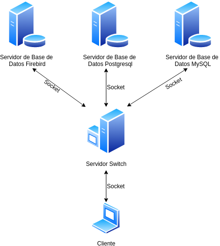

# Instructions  

## Firebird  

-1 Edit -> mcedit /etc/apt/sources.list  
    Add -> deb http://ftp.de.debian.org/debian jessie main  

-2 Install -> apt-get install firebird2.5-super  
              apt-get install firebird-dev  

-3 Search libfbclient.so -> /opt/firebird/lib and copy to /usr/lib  
          cp /opt/firebird/lib/libfbclient.so /usr/lib  
          ln -s /usr/lib/libfbclient.so.1.m.n /usr/lib/libfbclient.so.1  
          ln -s /usr/lib/libfbclient.so.1 /usr/lib/libfbclient.so  

-4 make libfb  

-5 gcc firebird.c -Wall -g -c -I /usr/include/firebird/ -lfb  

-6 gcc -Wall -o svf  svSgbd.c ini/ini.o firebird/firebird.o -lfb

    //Before.. gcc -Wall ini.c https://github.com/Teklad/tconfig

-7 Run Sv --> svf firebird | postgresql | mysql

## PostgreSQL  

-1 apt-get install postgresql  
-2 apt-get install libpq-dev  
-3 gcc postgresql.c -Wall -g -c -lpq -I/usr/include/postgresql/  
-4 gcc -Wall -o svf  svSgbd.c ini/ini.o postgresql/postgresql.o -lpq firebird/firebird.o -lfb  

Manage postgresql from console https://www.a2hosting.com/kb/developer-corner/postgresql/managing-postgresql-databases-and-users-from-the-command-line  

## MySQL  

-1 apt-get install mysql-server  
-2 apt-get install libmysqlclient-dev  
-3 gcc mysql.c -Wall -g -c -L/usr/lib/mysql -lmysqlclient  
-4 gcc -Wall -o svf  svSgbd.c ini/ini.o postgresql/postgresql.o -lpq firebird/firebird.o -lfb mysql/mysql.o -lmysqlclient  

## Switch Server  

-1 gcc -Wall -g -c ini/ini.c  
-2 gcc -Wall -o svSwitch ini/ini.o svSwitch.c  

## Example Query
  >sgbd/databaseName/query  
  >firebird/facturacion/select * from factura  
  >postgresql/personal/select * from empleado  
  >mysql/gestion_de_recursos/select * from productos  

## Running environment
	Databases servers:
		MySQL 5.7 running on Ubuntu18.04
		PostgreSQL 11.1.1 with pgAdmin 4 running on Ubuntu18.04
		Firebird 2.5 running on Ubuntu18.04
	Switch server: running on Debian10

